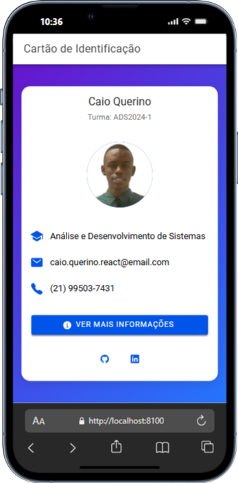

# Documentação do Projeto: Cartão de Identificação Digital

# 📋 Índice

[1. Visão Geral do Projeto](#visão-geral-do-projeto)

[2. Tecnologias Utilizadas](#tecnologias-utilizadas)

[3. Estrutura do Projeto](#estrutura-do-projeto)

[4. Funcionalidades Implementadas](#funcionalidades-implementadas)

[5. Como Executar o Projeto](#como-executar-o-projeto)

[6. Capturas de Tela](#capturas-de-tela)

[7. Link do Repositório](#link-do-repositório)

# Visão Geral do Projeto
O Cartão de Identificação Digital é uma aplicação web desenvolvida com Angular 17 e Ionic 7, utilizando a arquitetura de componentes standalone. A aplicação permite que estudantes apresentem suas informações acadêmicas de forma digital, com navegação entre telas e interface moderna.

Objetivo: Desenvolver um cartão digital de identificação acessível via navegador que apresente informações principais em uma tela inicial e permita acesso a detalhes adicionais em uma segunda tela.

# Tecnologias Utilizadas
- Angular 17 (Framework principal)

- Ionic 7 (Framework UI para componentes móveis)

- TypeScript (Linguagem de programação)

- SCSS (Pré-processador CSS)

- HTML5 (Estrutura das páginas)

- Git/GitHub (Controle de versão e hospedagem)

# Estrutura do Projeto
```
src/
├── app/
│   ├── pages/
│   │   ├── home/
│   │   │   ├── home.page.ts
│   │   │   ├── home.page.html
│   │   │   └── home.page.scss
│   │   └── about/
│   │       ├── about.page.ts
│   │       ├── about.page.html
│   │       └── about.page.scss
│   ├── app.component.ts
│   ├── app.config.ts
│   ├── app.routes.ts
│   └── main.ts
├── assets/
├── theme/
│   └── variables.scss
├── styles.scss
└── index.html
```

# Funcionalidades Implementadas

✅ Tela Principal (Home)
- Exibição do avatar do estudante

- Informações pessoais (nome, turma)

- Detalhes de contato (email, telefone)

- Botão de navegação para "Sobre"

- Links para redes sociais (GitHub e LinkedIn)

✅ Tela Sobre (About)
- Texto de apresentação pessoal

- Lista de habilidades técnicas

- Informações acadêmicas

- Interesses pessoais

- Botão de retorno para a tela principal

✅ Navegação
- Roteamento entre componentes

- Botões de navegação intuitivos

- Animações suaves de transição

# Como Executar o Projeto
## Pré-requisitos

- Node.js (versão 18 ou superior)

- npm (versão 9 ou superior)

- Angular CLI (versão 17 ou superior)

# Passo a Passo

1. Clone o repositório:
``` 
git clone https://github.com/CaioQuerino/identication-card-angular.git
```

2. Instale as dependências:
``` 
cd identication-card-angular
npm install
```

3. Execute o projeto:
```
ionic serve
# ou
ng serve
```

4. Acesse no navegador:
```
http://localhost:4200
```

# Capturas de Tela


# Link do Repositório
[Identification card](https://github.com/CaioQuerino/identication-card-angular)

___
```
Desenvolvido por: Caio Querino
Turma: ADS
Instituição: UNISUAM
Data de Entrega: 04/09/2025
```